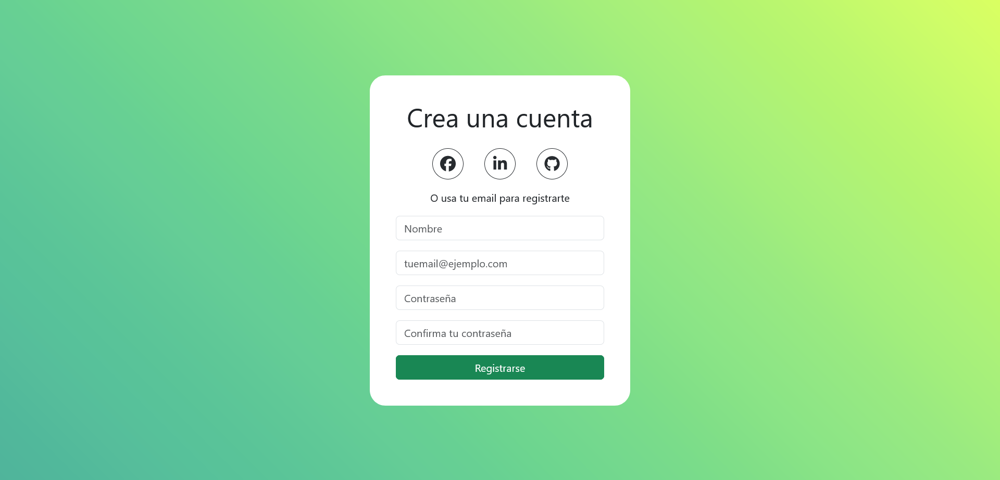
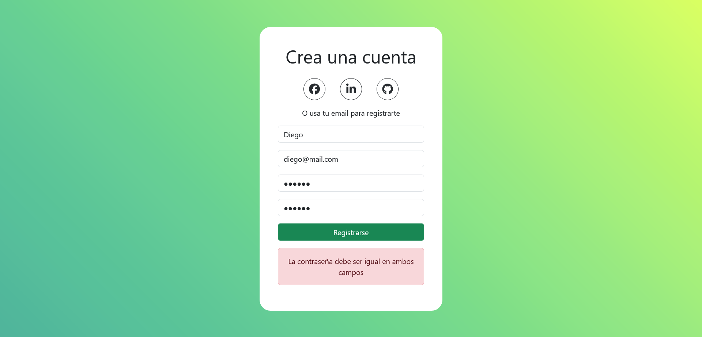
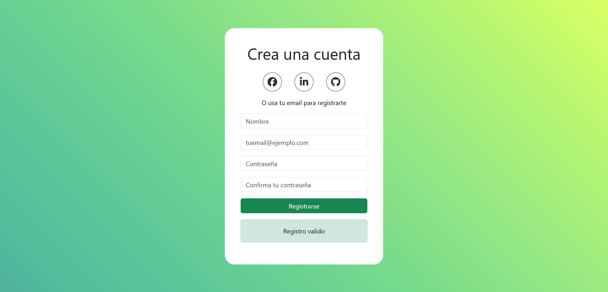

# Desafío 2 - Validación de Formulario de Registro 📝

En este desafío, he aplicado los conceptos de "Estado de los componentes y eventos" para desarrollar una aplicación en React que permite a los usuarios validar un formulario de registro utilizando eventos onChange y onSubmit.

## Descripción del Desafío 🤓

El objetivo de este desafío era crear una aplicación en React que permitiera a los usuarios validar un formulario de registro utilizando eventos onChange y onSubmit. La aplicación debía incluir al menos cuatro componentes: Registro, SocialButton, Formulario y Alert. El componente Registro importaría los otros componentes y mostraría un formulario de registro con campos para nombre, correo electrónico, contraseña y confirmación de contraseña. La validación del formulario debía realizarse mediante el evento onSubmit, verificando que el correo electrónico tuviera el formato correcto y que las contraseñas coincidieran.

## Capturas de Pantalla 🖼️

### Vista del Formulario de Registro


### Despliegue de errores detectados


### Registro exitoso sin errores


## Requerimientos del Desafío 🎯

1. **Creación de al menos 4 componentes:** Se debían crear los componentes Registro, SocialButton, Formulario y Alert, donde el componente Registro importaría los otros componentes.

2. **Uso de State para los inputs del Formulario:** El componente Formulario debía tener un formulario con campos para nombre, correo electrónico, contraseña y confirmación de contraseña, y utilizar useState para almacenar los estados de los inputs y relacionarlos con el evento onChange.

3. **Validación del Formulario:** El botón del formulario debía validar mediante el evento onSubmit que el correo electrónico tuviera el formato correcto y que las contraseñas fueran iguales.

4. **Mostrar un mensaje de Alerta:** Después de presionar el botón para registrarse, el componente Alert debía mostrar un mensaje indicando si el registro fue exitoso o si los campos estaban vacíos.

5. **Estilo de la Aplicación:** Se debía replicar el estilo de la aplicación utilizando Bootstrap.

## Solución a Requerimientos 😉

### Registro.jsx
```jsx
import { useState } from 'react';
import Formulario from './Formulario';
import Alert from './Alert';
import SocialButton from './SocialButton';

const Registro = ({ tituloRegistro, recomendacionRegistro, alert, setAlert }) => {
  return (
    <div className="registro-container">
      <h1>{tituloRegistro}</h1>
      <div className="social-container">
        <SocialButton iconClasses="fa-brands fa-facebook fa-xl" />
        <SocialButton iconClasses="fa-brands fa-linkedin-in fa-xl" />
        <SocialButton iconClasses="fa-brands fa-github fa-xl" />
      </div>
      <p>{recomendacionRegistro}</p>
      <Formulario setAlert={setAlert} />
      {alert.error && <Alert alert={alert} />}
    </div>
  );
}

export default Registro;
```

### Formulario.jsx
```jsx
import { useState } from 'react';

const Formulario = ({ setAlert }) => {
  const [nombre, setNombre] = useState('');
  const [email, setEmail] = useState('');
  const [contrasena, setContrasena] = useState('');
  const [confirmarContrasena, setConfirmarContrasena] = useState('');

  const validarEmail = (correo) => {
    // Implementación de la validación del correo electrónico
  }

  const limpiarInputs = () => {
    // Implementación para limpiar los inputs del formulario
  }

  const validacionFormulario = (e) => {
    // Implementación de la validación del formulario
  }

  return (
    <div className="formulario-container">
      {/* Implementación del formulario con los inputs y el botón de registro */}
    </div>
  );
}

export default Formulario;
```

### Alert.jsx
```jsx
const Alert = ({ alert }) => {
  return (
    <div className="alert-container">
      <div className={`alert alert-${alert.color}`} role="alert">
        {alert.msj}
      </div>
    </div>
  );
}

export default Alert;
```

### SocialButton.jsx
```jsx
const SocialButton = ({ iconClasses }) => {
  return (
    <a href="">
      <div className="social-icon-container">
        <i className={iconClasses}></i>
      </div>
    </a>
  );
}

export default SocialButton;
```

## Tecnologías Utilizadas 💻

- React
- CSS
- Bootstrap

## Estructura del Código 🧱

El código de la aplicación está estructurado utilizando React, con componentes individuales para el registro, el formulario, la alerta y los botones sociales. Se ha utilizado CSS para los estilos y Bootstrap para replicar el diseño proporcionado.

## Mejoras Futuras 🚀

Para futuras iteraciones de la aplicación, se podría considerar agregar funcionalidades adicionales como validaciones más complejas, recuperación de contraseña o integración con servicios de autenticación.